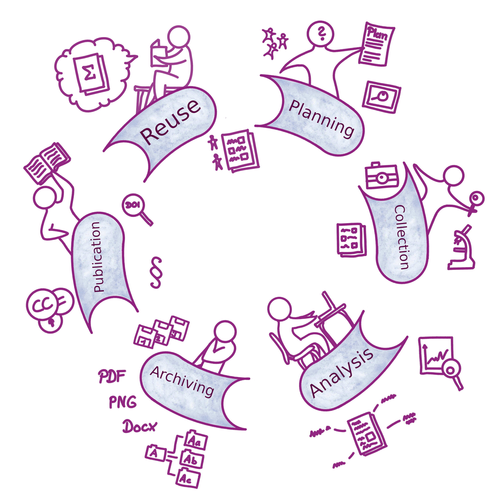
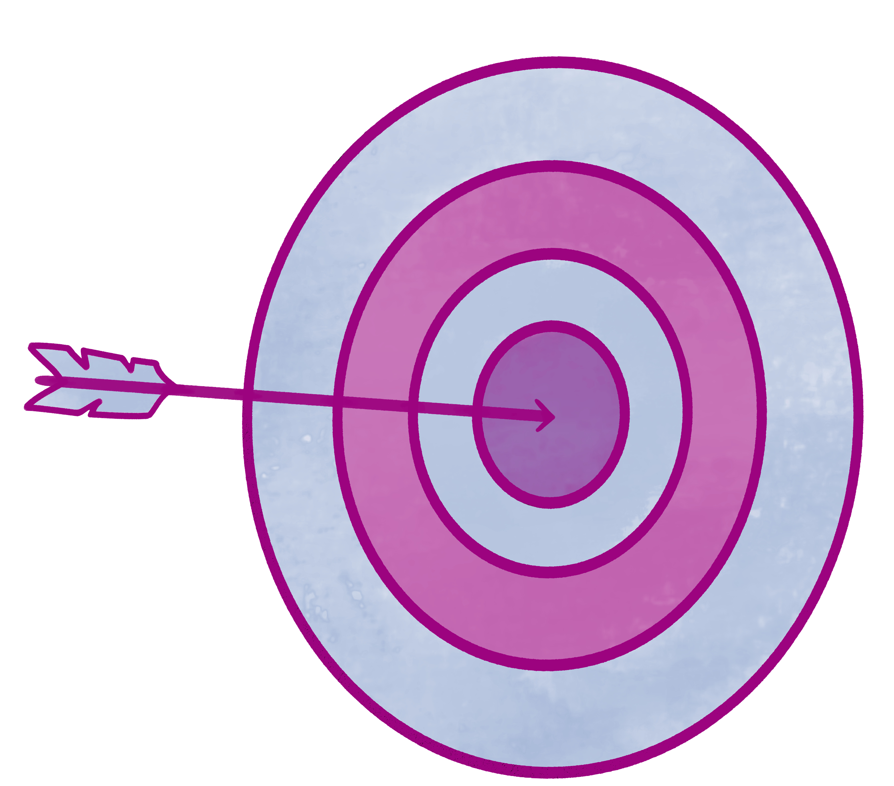
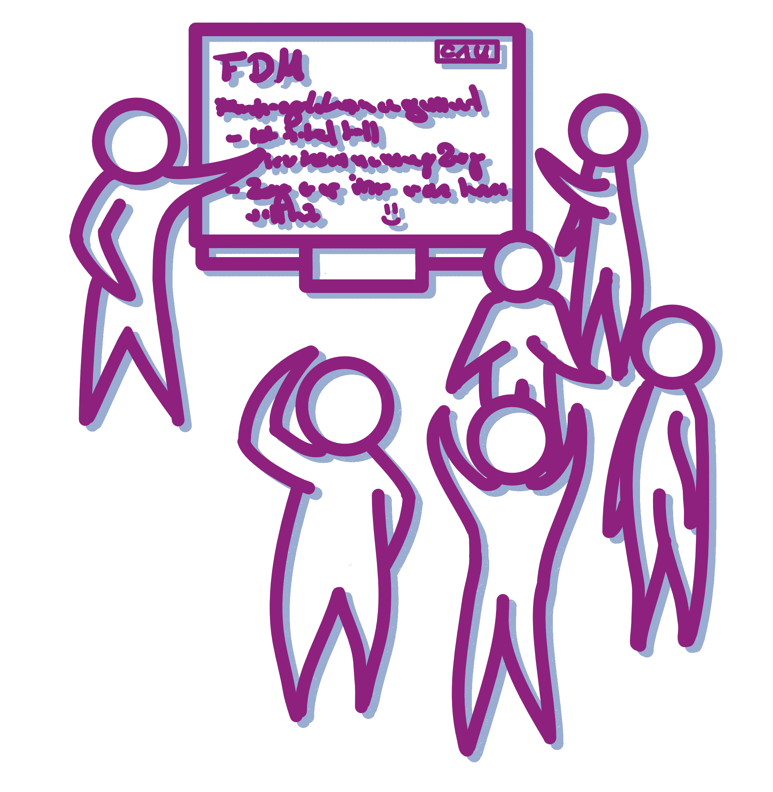
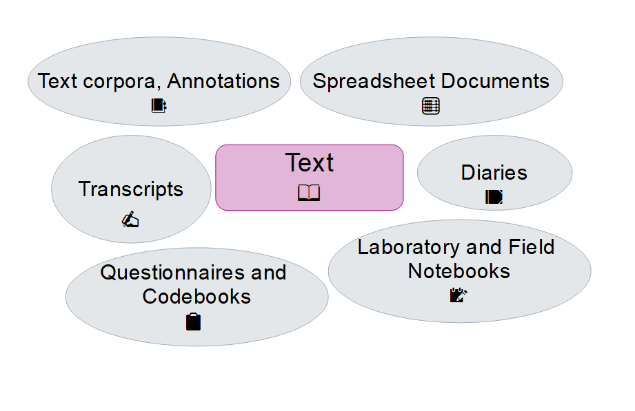
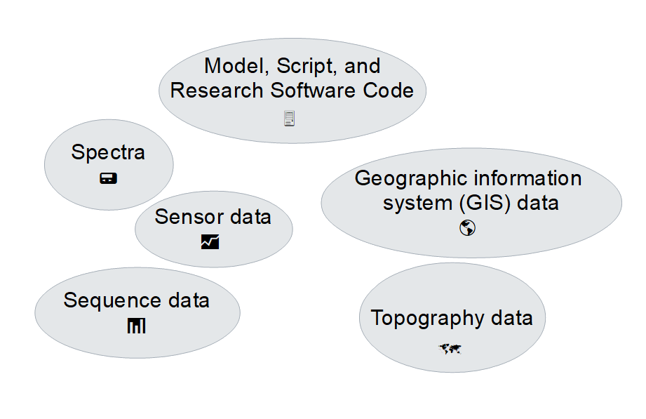
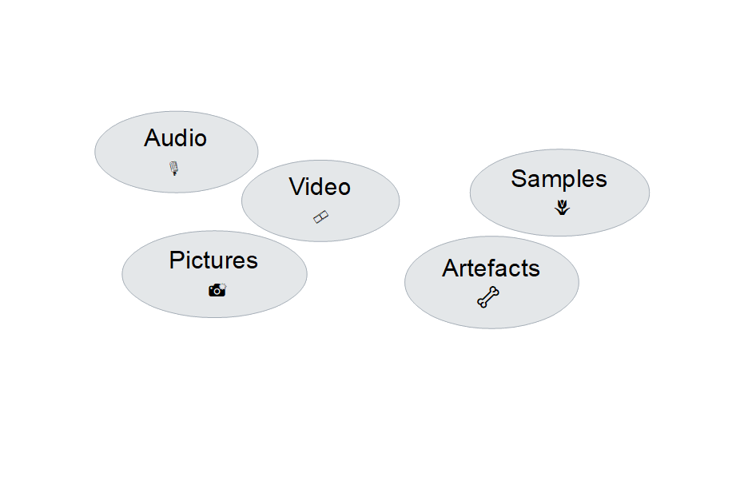
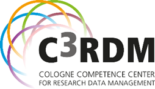

<!--

author:   Linda Zollitsch
email:    zollitsch@ub.uni-kiel.de
version:  0.1.0
language: en
narrator: UK English Female

logo: ./images/logo.png

icon:     ./images/logo.png

date: 2026-09-16
link: /style_css.css

comment:   Why RDM matters, research data management and data management plan basics

-->

# Why RDM matters

Linda Zollitsch | Central Research Data Management at Kiel University

2026-09-16

## Agenda

* Why is Research Data Management important?

* What is Research Data Management?

* Components of a Data Management Plan

* Benefits of RDM and DMP

## Goals

 
  

At the end of the workshop you…

- have a basic idea of the general concept of RDM and know some important related terms.
- can describe what research data and research data management is.
- can describe basics about the data management plan.

# Why is Research Data Management important?

-----

Let us first watch a short video

<iframe width="560" height="315" src="https://www.youtube.com/embed/66oNv_DJuPc
" title="YouTube video player" frameborder="0" allow="accelerometer; autoplay; clipboard-write; encrypted-media; gyroscope; picture-in-picture; web-share" allowfullscreen></iframe>

(https://www.youtube.com/watch?v=66oNv_DJuPc)

{{1}}
****************

- What do you think about the video?

- Has someone experienced similar things already?

- Which parts of the video do you think refer to research data management?

****************

# What is Research Data Management?

 
   

## Research Data

{{0-1}}
****************
... are...

"Any information you use in your research."

https://www.repository.cam.ac.uk/handle/1810/243750

****************

### Examples of Research Data

{{1-2}}
****************

 
   

****************

{{2-3}}
****************

 
   

****************

{{3}}
****************

 
   

****************

### Definition of Research Data

---

>"The term “research data” generally refers to all kinds of (digital) data that represent the result of scientific work or that serve as a basis for such work. Research data is generated using a wide variety of methods, such as measurements, source research or surveys. Therefore, it is always subject- and project-specific."

https://www.uni-giessen.de/ub/en/resteach/researchdata#anchor_what-is-research-data

## Research Data Management

### Definition RDM

{{1}}
****************
>"Research data management is an explicit process covering the creation and stewardship of research materials to enable their use for as long as they retain value."

https://www.dcc.ac.uk/about/digital-curation/glossary#R

****************

{{2}}
****************
Research Data Management concerns all aspects of the research process. From simple aspects like naming conventions for data and folder up to complex aspects like specific digital tools that are needed for the research process.

****************

### Data in the Research Process

 <!-- width="500px" -->

### Components of the Research Data Lifecycle

#### Planning:

In the planning phase, think about the following:

- Responsibilities in research process 
- Legal and ethical aspects
- Regarding your data:
  - Creating new data
  - Reuse of data and data availability
  - Data formats
  - Volume of data
  - Necessary software or requirements for analysing

#### Collection and Analysis:

In the collection and analysis phase, think about the following:

- Methods and tools to collect and save the (raw) data
- Documentation of research process
- Methods and tools to read, use, and analyse the data
- Storage of the data during the project
- Back up strategy
- Securing sensitive data during the project

#### Archiving & Publication:

In the archiving and publication phase, think about the following:

- Legal and ethical conditions in regard of publishing the research data
- Restrictions regarding publication or accessibility
- Usage, copyright or ownership issues
- Scientific codes and professional standards

#### Reuse:

In the reusing phase, think about the following:

- Suitability of data for reuse
- Archiving data in a suitable infrastructure
- Embargo periods

## FAIR Data Principles

{{0}}
****************

> An important goal of research data management is to keep data **FAIR**>FAIR in the **long term** and **independent of individuals**.

****************

{{1}}
****************

**FAIR Data Principles**

🔍 Findable (use persistent identifier (PIDs) like DOI, ORCiD, ROR...)

🔐 Accessible (make Metadata available, describe how to get access)

🔗 Interoperable (use Standards and open formats like csv, svg, jpg)

♻️ Reusable (use licences, have a data documentation)

****************

## RDM checklist

1. Consider applicable policies

2. Account for ethical regulations and legislation

3. Have a sound data storage and security concept

4. Keep your working directories clean

5. Have a sound data collection strategy

6. Work on comprehensive documentation

7. Develop a data management plan

8. Make use of standard and open file formats

9. Share your research data

10. Continuous self-monitoring

Hassenstein, M. J., & Jung, K. (2025). Ten simple rules for effective research data management. PLoS computational biology, 21(12), e1013779. https://doi.org/10.1371/journal.pcbi.1013779

# Data Management Plan

## Definition of DMP

"The Data Management Plan is a living summary document that provides assistance with organising and planning all the phases in the lifecycle of data. It explains, for each dataset, how project data will be managed, from creation or collection to sharing and archiving."

https://www.universite-paris-saclay.fr/en/recherche/science-ouverte/introduction-data-management-plans

## Components of a DMP

- Administrative data
- Data Description
- Data documentation & quality control
- Storage & Backup
- Legal aspects
- Data publication
- Responsibilities & Ressources

**Length can vary from a few paragraphs to several pages!**

### Administrative data

  - Basic data
    - Project title
    - data originator
    - other contributors
    - contact
    - funding organisation, grant number
  
  - Relevant guidelines and policies 

### Data Description

  - Type of research data

    - data types and formats that are reused or generated
    - tools or software to be used

  - volume
    - amount of data to be expected
    - size of the largest individual file

### Data documentation & quality control

  - folder and file naming conventions
  - versioning
  - metadata standards
  - controlled vocabularies / ontologies
  - supporting documentation
  - virtual research environments / databases / ELAB journals

### Storage & Backup

  - storage and data sharing during the project
  - backup strategy
  - access control according to protection requirements (e.g. GDPR)
  - long-term storage according to GRP

### Legal aspects

  - Data protection
  - Copyright and rights of use
  - Licensing law, patent law, etc.

### Data publication

  - selection of datasets
  - name of the (domain-specific) repository
  - timeline of data transfer to the archive
  - time of publication (embargo, if applicable)
  - reason for restrictions
  - selection of usage licenses

### Responsibilities & Ressources

  - Who is responsible for RDM?

    - regulation of responsibilities
    - access control
    - training of project participants
    - data curation

  - What does RDM cost?
    - Budget at least 5% for RDM costs!

## Templates & Tools

{{1}}
****************

**Templates**

* [DFG Checklist (for section 2.4 of the proposal)](https://www.dfg.de/download/pdf/foerderung/grundlagen_dfg_foerderung/forschungsdaten/forschungsdaten_checkliste_en.pdf)

* [EU Horizon Europe-Template](https://fdm.uni-koeln.de/sites/FDM-UzK/Templates/data-management-plan-template_he_en-2.docx)

* [Science Europe Template](https://www.scienceeurope.org/our-priorities/research-data/research-data-management/)

****************

{{2}}
****************

**DMP Tools**

[Research Data Management Organizer (RDMO) - DFG-funded](https://rdmorganiser.github.io/)

[DMPonline - Digital Curation Centre (DDC), hosted by University of Edinburgh](https://dmponline.dcc.ac.uk/)

[DMP Tool - California Digital Library](https://dmptool.org/)

****************

## Common mistakes in DMP writing

* lack of accuracy

* reuse of (generic) text blocks

* terminological inaccuracies

* lack of resource calculation

## DMP checklist

1. Determine the Research Sponsor Requirements

2. Identify the Data to Be Collected

3. Define How the Data Will Be Organized

4. Explain How the Data Will Be Documented

5. Describe How Data Quality Will Be Assured

6. Present a Sound Data Storage and Preservation Strategy

7. Define the Project’s Data Policies

8. Describe How the Data Will Be Disseminated

9. Assign Roles and Responsibilities

10. Prepare a Realistic Budget

Michener WK (2015) Ten Simple Rules for Creating a Good Data Management Plan. PLoS Comput Biol 11(10): e1004525. 
https://doi.org/10.1371/journal.pcbi.1004525

# Benefits of Research Data Management

{{1}}
****************
... from the Researchers perspective

- a structured process ➡️ more time for the "real" research

- good data documentation ➡️ easy access to your reseach process

- minimizing data loss

- makes it easier to publish data ➡️
  - reuse of your own data in a follow up project
  - more visibility
  - increasing reputation

****************

{{2}}
****************
... from the structural perspective

- compliance with good scientific practice

- compliance with rules of funders

- compliance with GDPR

****************

## RDM in a nutshell

- Systematic file and folder naming and hierarchy

- document changes

- think about metadata necessary to understand your data

- use Open Document Format (ODF)

- __Generic and open standard file formats__ last longer than proprietary file formats

- Desktop and laptop for work on current research data only

- [Creative Commons](https://creativecommons.org/): data with a necessary creation height; ideally CC0 or CC BY

## Questions

>Nearly done!
> <!--
style="width: 10%; max-width: 800px; float:right"
title="puzzle"
onclick="alert('Questions?');"
-->
>
>Time for questions!

## Acknowledgement

If not stated otherwise, all graphics and illustrations are designed by Cleo Michelsen

**

Some parts of this workshop material is based on:

Schenk, Jasmin & Mühlichen Andreas: „How to write a data management plan?“
[Cologne Competence Center for Research Data Management (C3RDM)](https://fdm.uni-koeln.de/home)
Universität zu Köln

**

Thanks a lot for sharing! 🥰

## Thank you! :-)

Please take care of your data! 🌼
---

